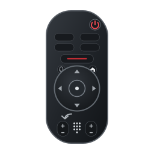

# Freebox Pop Remote

<p align="center">
  
</p>

Télécommande pour **Freebox Player Pop / Player TV Free 4K** sous **Linux, Windows et macOS**, utilisant
le protocole réseau **Android TV Remote v2**.

Version actuelle : **1.1.0**.

L'application fournit une télécommande graphique compacte inspirée de la
télécommande physique du Player Pop, avec découverte réseau, appairage,
sélection de plusieurs Players et pavé numérique.

> Projet indépendant, non affilié ni approuvé par Free / Iliad. Les marques
> citées appartiennent à leurs propriétaires respectifs.

## Fonctionnalités

- découverte mDNS via `_androidtvremote2._tcp.local.` ;
- saisie manuelle d'une IP si le multicast est filtré ;
- appairage Android TV par code affiché sur le téléviseur ;
- conservation locale des certificats d'appairage ;
- plusieurs Players configurables avec alias facultatif ;
- reconnexion automatique ;
- D-pad, OK, Retour, Home, Power ;
- Volume +/−, Muet, Programme +/− ;
- pavé numérique 0–9 ;
- raccourcis Free TV, Netflix, Prime Video, CANAL+ et Disney+ ;
- raccourcis clavier ;
- commande vocale push-to-talk depuis le microphone du PC ;
- fenêtre Qt sans cadre et fond transparent.

Pour parler au Player, maintenir le bouton microphone enfoncé puis le relâcher
à la fin de la commande. La capture est transmise en PCM 16 bits mono à 8 kHz.
Si le microphone, sa permission ou la fonction vocale du Player est indisponible,
la télécommande reste utilisable et affiche un message explicite.

## Capture / interface

La fenêtre principale est volontairement réduite au contour de la télécommande.
Le bouton **⚙** permet de scanner le réseau, configurer ou renommer un Player.
Le sélecteur central permet de basculer entre plusieurs Players déjà configurés.

## Installation développeur

Prérequis : Python 3.10 ou plus récent.

Après avoir cloné le dépôt :

```bash
cd freebox-pop-remote

python3 -m venv .venv
source .venv/bin/activate
python -m pip install --upgrade pip
python -m pip install -e ".[dev]"

freebox-pop-remote
```

Ou :

```bash
python -m freebox_pop_remote
```

## Lancer les tests

Les tests unitaires n'ont pas besoin d'un Player physique.

```bash
pytest
```

Avec couverture :

```bash
pytest --cov=freebox_pop_remote --cov-report=term-missing
```

Vérification de style :

```bash
ruff check .
ruff format --check .
```

## Arborescence

```text
.
├── .github/
│   └── workflows/
│       ├── ci.yml
│       └── release.yml
├── packaging/
│   ├── build-linux.sh
│   ├── build-windows.ps1
│   ├── build-macos.sh
│   ├── build-deb.sh
│   ├── build-rpm.sh
│   └── standalone_entry.py
├── src/
│   ├── assets/
│   │   ├── freebox-pop-remote.svg
│   │   ├── freebox-pop-remote-48.png
│   │   ├── freebox-pop-remote-64.png
│   │   ├── freebox-pop-remote-128.png
│   │   ├── freebox-pop-remote-256.png
│   │   └── freebox-pop-remote-512.png
│   ├── __init__.py
│   ├── __main__.py
│   ├── app.py
│   ├── backend.py
│   ├── config.py
│   ├── constants.py
│   ├── dialogs.py
│   ├── main.py
│   ├── models.py
│   ├── utils.py
│   ├── widgets.py
│   └── window.py
├── test/
│   ├── test_config.py
│   ├── test_models.py
│   ├── test_package.py
│   ├── test_utils.py
│   └── test_desktop_assets.py
├── .gitignore
├── Makefile
├── freebox-pop-remote.desktop
├── LICENSE.md
├── pyproject.toml
└── README.md
```

## Configuration locale

Configuration :

```text
~/.config/freebox-pop-remote/config.json
```

Certificats d'appairage :

```text
~/.local/share/freebox-pop-remote/<player>/cert.pem
~/.local/share/freebox-pop-remote/<player>/key.pem
```

Ces emplacements sont stables et sont conservés lors des mises à jour.

## Raccourcis clavier

| Clavier Linux | Commande TV |
|---|---|
| Flèches | Navigation |
| Entrée | OK |
| Échap / Retour arrière | Retour |
| Home | Accueil Android TV |
| 0–9 | Touches numériques |
| `+` / `-` | Volume |
| PageUp / PageDown | Programme +/− |
| Espace | Lecture / pause |

## Raccourcis d'applications

Ils utilisent les App Links Android TV et sont modifiables depuis les réglages.

Valeurs par défaut :

```json
{
  "free": "https://oq.ee/home/",
  "netflix": "netflix://",
  "prime": "https://app.primevideo.com",
  "canal": "https://www.canalplus.com/",
  "disney": "https://www.disneyplus.com"
}
```

## Build Linux autonome

`packaging/build-linux.sh` produit l’exécutable Linux autonome :

```bash
./packaging/build-linux.sh
```

Sortie :

```text
dist/linux/freebox-pop-remote
```

Le binaire est construit avec Nuitka en mode `onefile`. Python, PySide6,
`androidtvremote2` et les modules Python nécessaires sont embarqués dans
l’exécutable ; aucun venv, pipx ou runtime Python applicatif n’est installé sur
la machine cible.

### Note sur zeroconf

`zeroconf` fournit des accélérateurs Cython optionnels. Avec Nuitka en mode
`onefile`, ces extensions peuvent être incompatibles avec les classes Python
compilées par Nuitka et provoquer au lancement une erreur du type :

```text
ValueError: zeroconf._updates.RecordUpdateListener size changed,
may indicate binary incompatibility
```

Le script installe donc volontairement **zeroconf en Python pur**
(`SKIP_CYTHON=1`), vérifie qu’aucune extension `.so`/`.pyd` de zeroconf n’est
présente, puis exécute un smoke-test du binaire final.

## Paquet Debian / Ubuntu

```bash
./packaging/build-deb.sh
```

Si `dist/linux/freebox-pop-remote` n’existe pas, `build-deb.sh` appelle
automatiquement `build-linux.sh`.

Le `.deb` contient **le binaire autonome** et les fichiers d’intégration Linux
(`.desktop`, icônes, README, licence). Il n’installe pas Python, pip, pipx ou un
environnement virtuel applicatif.

Sorties :

```text
dist/linux/freebox-pop-remote-1.1.0-linux-amd64.deb
dist/linux/freebox-pop-remote-1.1.0-linux-arm64.deb
```

## Paquet RPM

Pour Fedora / RHEL et distributions compatibles RPM :

```bash
./packaging/build-rpm.sh
```

Le script nécessite `rpmbuild` (`sudo dnf install rpm-build` sur Fedora). Comme
pour le `.deb`, si le binaire Linux autonome est absent, `build-linux.sh` est
lancé automatiquement.

Les sorties sont placées dans `dist/linux/` :

```text
dist/linux/freebox-pop-remote-1.1.0-linux-x86_64.rpm
dist/linux/freebox-pop-remote-1.1.0-linux-aarch64.rpm
```

## Résumé des builds Linux

```text
build-linux.sh
    └── dist/linux/freebox-pop-remote

build-deb.sh
    ├── appelle build-linux.sh si nécessaire
    └── dist/linux/freebox-pop-remote-1.1.0-linux-{amd64,arm64}.deb

build-rpm.sh
    ├── appelle build-linux.sh si nécessaire
    └── dist/linux/freebox-pop-remote-1.1.0-linux-{x86_64,aarch64}.rpm
```

## Sécurité

La clé privée d'appairage reste sur la machine locale. Ne publiez jamais les
fichiers `key.pem`.

## Dépendances principales

- [PySide6](https://doc.qt.io/qtforpython-6/)
- [androidtvremote2](https://github.com/tronikos/androidtvremote2)
- [zeroconf](https://github.com/python-zeroconf/python-zeroconf)

## Licence

Le code de cette application est distribué sous licence MIT. Voir
[`LICENSE.md`](LICENSE.md).

Les dépendances tierces conservent leurs propres licences.

## Construction et installation avec Make

Aucun `./configure` n'est nécessaire. La configuration de compilation est
volontairement minimale et déterminée par l'OS courant.

```bash
make
sudo make install
```

Sous Linux, `make` construit le binaire Nuitka autonome puis `make install`
installe par défaut sous `/usr/local` :

```text
/usr/local/bin/freebox-pop-remote
/usr/local/share/applications/freebox-pop-remote.desktop
/usr/local/share/icons/hicolor/{48,64,128,256,512}x.../freebox-pop-remote.png
/usr/local/share/icons/hicolor/scalable/apps/freebox-pop-remote.svg
/usr/local/share/doc/freebox-pop-remote/
```

Le Makefile respecte `PREFIX` et `DESTDIR`, par exemple :

```bash
sudo make install PREFIX=/usr
make install PREFIX=/usr DESTDIR=/tmp/package-root
```

Autres cibles :

```bash
make linux       # binaire Linux autonome
make deb         # .deb ; construit Linux automatiquement si nécessaire
make rpm         # .rpm ; construit Linux automatiquement si nécessaire
make windows     # .exe, à lancer sous Windows
make macos       # .app, à lancer sous macOS
make test
make lint
make check-install
sudo make uninstall
```

`make` sans cible choisit automatiquement `linux`, `windows` ou `macos` selon
l'OS sur lequel il est exécuté. Les builds natifs doivent être réalisés sur
leur OS cible.

## Icône et identité desktop Linux

Le lanceur freedesktop utilise `Icon=freebox-pop-remote`. Le `.deb`, le `.rpm`
et `make install` installent tous le même SVG et les PNG 48/64/128/256/512 du
dossier `src/assets/`. L'application Qt déclare également explicitement
`freebox-pop-remote` comme nom de fichier desktop afin que GNOME/Wayland puisse
associer la fenêtre au bon lanceur et donc à la bonne icône.


## GitHub Actions

Le workflow `.github/workflows/release.yml` construit les artefacts natifs sur
les runners GitHub correspondant à chaque système :

- Linux x86_64 : binaire autonome, `.deb` et `.rpm` ;
- Linux ARM64 natif : binaire autonome, `.deb` et `.rpm` ;
- Windows x86_64 : `.exe` autonome ;
- macOS Apple Silicon : archive `.zip` contenant le `.app` ;
- macOS Intel : archive `.zip` contenant le `.app`.

Le workflow peut être lancé manuellement depuis **Actions → Build and release →
Run workflow**. Dans ce cas les fichiers sont disponibles comme artefacts du
workflow.

Lorsqu'un tag `vX.Y.Z` est poussé, le workflow vérifie que `X.Y.Z` correspond à la
version déclarée dans `src/__init__.py`, construit toutes les plateformes puis
crée automatiquement la GitHub Release et y joint les artefacts ainsi que
`SHA256SUMS.txt`.

Les assets de la version 1.1.0 sont nommés exactement ainsi :

```text
freebox-pop-remote-1.1.0-linux-x86_64
freebox-pop-remote-1.1.0-linux-amd64.deb
freebox-pop-remote-1.1.0-linux-x86_64.rpm
freebox-pop-remote-1.1.0-linux-arm64
freebox-pop-remote-1.1.0-linux-arm64.deb
freebox-pop-remote-1.1.0-linux-aarch64.rpm
freebox-pop-remote-1.1.0-windows-x86_64.exe
freebox-pop-remote-1.1.0-macos-x86_64.zip
freebox-pop-remote-1.1.0-macos-arm64.zip
SHA256SUMS.txt
```

Les archives macOS contiennent `Freebox Pop Remote.app`. Le runner ARM64 Linux
est natif : aucun binaire x86_64 n'est renommé. Un lancement manuel construit,
vérifie et conserve tous les artefacts sans créer de release.

Après validation de la version 1.1.0 :

```bash
git tag v1.1.0
git push origin v1.1.0
```

Aucune clé ou secret personnalisé n'est nécessaire pour une release standard :
le workflow utilise le `GITHUB_TOKEN` fourni par GitHub avec la permission
`contents: write`.
